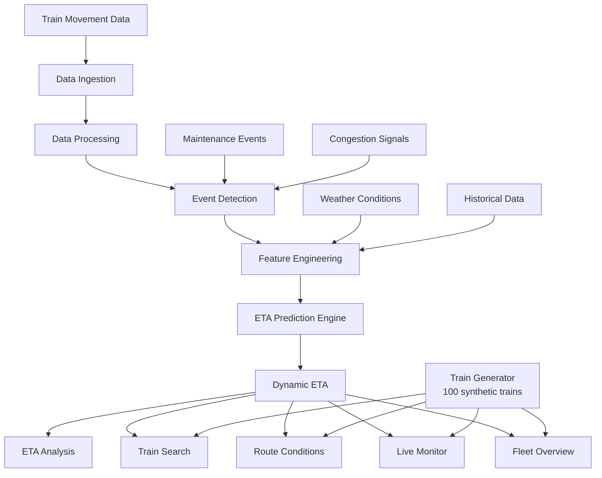

# SENRAIL

## Dynamic ETA Intelligence for Coaching Trains

**Smart India Hackathon 2026**
**Problem Statement ID:** SIH26028
**Problem Statement:** Dynamic Forecast of Expected Time of Arrival (ETA) for Coaching Trains
**Team:** RUNTIME REBELS

---

## Overview

Coaching trains on the Indian Railways network operate across thousands of route-kilometres under conditions that change continuously — congestion between sections, track maintenance windows, weather disruptions, signal delays, and unscheduled stoppages. The published schedule provides a static reference, but actual arrival times are influenced by a complex combination of factors that the schedule cannot account for in real time.

**SENRAIL** is a predictive intelligence layer for dynamic ETA forecasting. It continuously combines train movement data and operational conditions to forecast when a train is likely to reach upcoming stations and its final destination — and it explains why the ETA changed.

SENRAIL is not a replacement for existing railway information systems such as RTIS or NTES. It is designed to sit above those systems, consuming authorised train-movement and operational feeds to produce forward-looking arrival estimates.

---

## What's Inside

SENRAIL is a complete, production-quality prototype with the following pages and capabilities:

| Page | What It Does |
|---|---|
| **Overview** | Fleet-wide dashboard: 100-train stats, live simulation strip, speed/delay charts, searchable fleet table |
| **Live Train Monitor** | Full 100-train table with per-train ETA, network map, station schedule detail |
| **Route Conditions** | Section-by-section weather, congestion, active events for all 100 train routes |
| **ETA Analysis** | ETA history chart, speed trend, delay trend, factor impact breakdown |
| **Simulation Lab** | Interactive scenario testing — activate congestion, maintenance, rain, signal holds |
| **Train Search** | Search 100 trains by number, name, origin, destination, date, and departure time |

---

## Our Solution

SENRAIL answers three operational questions in one continuous workflow:

1. **Where is the train?** — Current position, speed, section, and delay
2. **What is happening ahead?** — Congestion, maintenance, speed restrictions, weather, signal delays
3. **When will the train arrive?** — Predicted ETA at each upcoming station and at the destination, with a breakdown of contributing factors

The system dynamically recalculates ETA whenever relevant conditions change, and provides an explainability layer that shows exactly which factors are contributing to any delay.

---

## Core Capabilities

| Capability | Description |
|---|---|
| Dynamic ETA Forecasting | Continuous recalculation of arrival time based on current conditions |
| **100-Train Fleet Dataset** | Synthetic dataset of 100 coaching trains across 25 Indian Railway route pairs |
| Congestion Detection | Speed-pattern analysis across sections to identify congestion events |
| Track Maintenance Handling | Operational event processing with speed-restriction modelling |
| Weather Condition Modelling | Weather-based travel time adjustments per section |
| Signal Delay Handling | Discrete signal hold events incorporated into ETA |
| Historical Travel Pattern Analysis | Synthetic historical dataset for baseline sectional travel times |
| ETA Impact Explanation | Per-factor breakdown showing why ETA changed |
| Station-wise ETA Forecast | Predicted arrival at each intermediate station |
| ETA History Tracking | Time-series of predicted ETA as conditions evolve |
| Route Condition Monitoring | Section states, weather, congestion for all 100 routes |
| **SVG Network Map** | Schematic railway network diagram with highlighted train route and animated position |
| **Route Corridor Visualisation** | Horizontal station timeline with current position indicator |
| **Train Search** | Search by number, name, station, date (day-of-week), departure time range |
| Simulation Lab | Interactive scenario testing for demonstration |
| Simulated Railway Clock | Prototype uses a simulated clock (not wall time) for realistic ETA movement |
| API-Ready Architecture | Service layer structured for authorised railway feed integration |
| SENRAIL Branding | Custom logo on sidebar, header, and browser tab |

---

## How SENRAIL Works



### Prediction Formula (Prototype)

```
remaining_time =
    baseline_time              (historical sectional average)
  + congestion_effect          (based on congestion level)
  + maintenance_effect         (based on active maintenance + speed restriction)
  + weather_effect             (based on current weather condition)
  + signal_effect              (discrete signal hold minutes)
  + historical_variance        (small stochastic component)
  - recovery_component         (if train is currently ahead of schedule)
```

The formula is transparent and documented in [`docs/ETA_PREDICTION.md`](docs/ETA_PREDICTION.md).

---

## Screenshots / Pages

### Overview — Fleet Dashboard
- Live simulation summary strip with 🔴 LIVE badge
- 100-train fleet stats: total, running, delayed, halted, on-time
- Speed and delay trend charts (live, auto-updating)
- Searchable, filterable fleet table (paginated 20/page)
- Click any row → route corridor + station ETA

### Live Train Monitor
- Stats strip: total, running, delayed, avg speed, avg delay
- LIVE SIM card (12627 Karnataka Express with live station table)
- Click-to-inspect detail: network map + station schedule
- Full 100-train paginated table with Predicted ETA column

### Route Conditions
- 8-tile condition summary for all 100 sections
- LIVE SIM sections reacting to Simulation Lab scenarios
- Full route conditions table: condition, weather, congestion, event, ETA impact

### Train Search
- Search by: train number, name, origin, destination, station code
- Date picker → filters trains running on that day of week
- Time from/to → filters by departure time window
- Result cards with Predicted ETA badge
- Click card → route corridor + network map + station schedule table

### Network Map (SVG)
- Schematic of major Indian railway corridors (Western, Central, South)
- Selected train's route highlighted in **blue** with glow
- Current station marked with **pulsing orange dot**
- 20 stations: NZM, BPL, NGP, CSMT, BCT, SUR, SC, MAS, KPD, JTJ, BWT, KJM, SBC, MYS, ASK, DVG, UBL, CBE, ERS, TVC

---

## Demo

A full demo script is available at [`docs/DEMO_GUIDE.md`](docs/DEMO_GUIDE.md).

**Suggested Demo Flow:**

1. Open SENRAIL — **Overview** shows 100-train fleet stats and live simulation
2. Start simulation — watch speed, delay, ETA update live
3. Go to **Simulation Lab** → activate Heavy Congestion → ETA jumps
4. Go to **ETA Analysis** → show ETA history chart, speed chart, impact bars
5. Go to **Train Search** → type `12431` or `Rajdhani` → click result → see network map + corridor
6. Go to **Route Conditions** → filter by "Congested" → see affected sections
7. Go to **Live Monitor** → search `MAS` → see all Chennai trains with ETA

---

## Technology Stack

| Layer | Technology |
|---|---|
| Frontend Framework | React 18 with TypeScript |
| Build Tool | Vite 8 |
| Charting | Recharts |
| Network Map | Pure SVG (custom, no map library required) |
| Icons | Lucide React |
| Styling | Vanilla CSS (custom design system) |
| State Management | React Context + useReducer |
| Fonts | Inter (Google Fonts), JetBrains Mono |
| Train Data | Deterministic synthetic generator (100 trains) |

No external APIs are required. The application runs entirely in the browser.

---

## Installation

```bash
# Clone the repository
git clone <repository-url>
cd SENRAIL

# Install dependencies
npm install
```

---

## Running Locally

```bash
npm run dev
```

Opens at [http://localhost:5173](http://localhost:5173)

---

## Production Build

```bash
npm run build
```

Output is placed in the `dist/` directory. Serve with any static file server:

```bash
npm run preview
```

---

## Project Structure

```
SENRAIL/
├── src/
│   ├── components/
│   │   ├── DelayChart.tsx          # Delay trend area chart
│   │   ├── ETAChart.tsx            # ETA history area chart
│   │   ├── ETAPanel.tsx            # Predicted arrival display
│   │   ├── ImpactBarChart.tsx      # Contributing factors horizontal bar chart
│   │   ├── ImpactAnalysis.tsx      # Impact breakdown panel
│   │   ├── NetworkMap.tsx          # SVG schematic railway network map  ← NEW
│   │   ├── RouteConditionsTiles.tsx
│   │   ├── RouteVisualization.tsx  # Schematic route corridor diagram
│   │   ├── Sidebar.tsx             # Navigation (6 pages)
│   │   ├── SpeedChart.tsx          # Speed trend area chart
│   │   ├── StationTable.tsx
│   │   └── TopHeader.tsx
│   ├── data/
│   │   ├── staticData.ts           # Manual train catalog (6 trains) + helpers
│   │   └── trainGenerator.ts       # Deterministic 100-train generator  ← NEW
│   ├── pages/
│   │   ├── OverviewPage.tsx        # Fleet dashboard (redesigned)
│   │   ├── LiveMonitorPage.tsx     # 100-train monitor (redesigned)
│   │   ├── RouteConditionsPage.tsx # 100-section conditions (redesigned)
│   │   ├── ETAAnalysisPage.tsx     # ETA + Speed + Delay + Impact charts
│   │   ├── SimLabPage.tsx          # Simulation scenario controls
│   │   └── TrainSearchPage.tsx     # Search + filter + detail  ← NEW
│   ├── prediction/
│   │   └── etaPredictor.ts         # ETA prediction engine (formula-based)
│   ├── services/
│   │   └── api.ts                  # API abstraction layer
│   ├── simulation/
│   │   └── engine.ts               # Simulation engine + scenario presets
│   ├── store/
│   │   └── AppContext.tsx          # Global state (simulated clock + history arrays)
│   ├── types/
│   │   └── index.ts                # TypeScript domain types
│   ├── App.tsx
│   ├── main.tsx
│   └── index.css                   # Design system CSS + animations
├── docs/
│   ├── ARCHITECTURE.md
│   ├── TECHNICAL_DOCUMENTATION.md
│   ├── DATA_MODEL.md
│   ├── ETA_PREDICTION.md
│   ├── DEMO_GUIDE.md
│   ├── FUTURE_INTEGRATION.md
│   └── PROJECT_SCOPE.md
├── public/
│   └── senrail-logo.jpg            # SENRAIL brand logo (favicon + sidebar + header)
├── CONTRIBUTING.md
├── LICENSE
├── README.md
└── package.json
```

---

## Fleet Dataset

The prototype includes **100 synthetic trains** across 25 Indian Railway route corridors:

| Zone | Example Routes |
|---|---|
| NR/SR | Delhi (NZM) → Chennai (MAS), Delhi → Trivandrum (TVC) |
| NR/SWR | Delhi → Bengaluru (SBC) |
| NR/CR | Delhi → Mumbai CSMT |
| CR/SR | Mumbai CSMT → Chennai, Mumbai → Trivandrum |
| CR/SWR | Mumbai CSMT → Bengaluru |
| WR/SWR | Mumbai Central (BCT) → Bengaluru |
| SR/SWR | Chennai → Bengaluru, Mysuru → Chennai |
| SWR | Bengaluru → Hubli (UBL), Bengaluru → Mysuru |
| SCR/SR | Secunderabad (SC) → Chennai |

Train types in dataset: **Rajdhani, Duronto, Shatabdi, Superfast, Express, Mail**

> All 100 trains use deterministic synthetic data generated via a seeded RNG — consistent across every page load.

---

## Data Architecture

### Prototype

All train telemetry, operational events, and route conditions are **synthetic** and generated by the simulation engine and train generator. No real Indian Railways data is used or claimed. All screens clearly indicate **Simulation Mode** or **Synthetic Data**.

The simulated railway clock starts at **13:05** and advances **20 simulated seconds per 3-second real-time tick**, ensuring ETA charts show meaningful progression during any demo session.

### Future Deployment

The simulation layer is architecturally isolated in `src/simulation/engine.ts` and `src/data/trainGenerator.ts`. In a production deployment with authorised railway integration:

- The simulation engine is replaced by a data ingestion layer connected to authorised railway feeds (e.g., RTIS-style position and speed data, operational event streams)
- The `trainGenerator.ts` is replaced by live fleet data from the railway API
- The prediction engine (`src/prediction/etaPredictor.ts`) requires no modification
- The API abstraction layer (`src/services/api.ts`) provides the interface boundary

See [`docs/FUTURE_INTEGRATION.md`](docs/FUTURE_INTEGRATION.md) for details.

---

## Future Integration

SENRAIL's architecture is designed so the simulation layer can be replaced by authorised railway data feeds:

```
Current Prototype:                Future Deployment:
─────────────────────             ──────────────────────────────
Simulation Engine                 Authorised Railway Data Feed
      ↓                                       ↓
Train Generator (100 synthetic)   Live Fleet Data (RTIS/NTES)
      ↓                                       ↓
SENRAIL Data Ingestion            Streaming Ingestion Layer
      ↓                                       ↓
Event Detection                   Event Detection
      ↓                                       ↓
ETA Prediction Engine             ETA Prediction Engine (same)
      ↓                                       ↓
Dashboard (6 pages)               Passenger / Station / Control Apps
```

---

## Team

**RUNTIME REBELS**

SENRAIL · Smart India Hackathon 2026 · PS SIH26028

---

*All simulated data in this prototype is synthetic and for demonstration purposes only. SENRAIL does not claim to represent live Indian Railways operational data.*
