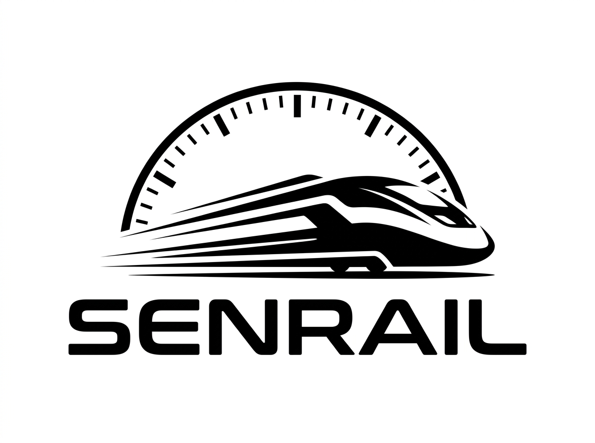

<div align="center">



# SENRAIL

### Dynamic ETA Intelligence for Coaching Trains

[](https://react.dev)
[](https://www.typescriptlang.org)
[](https://vite.dev)
[](https://www.sih.gov.in)
[](LICENSE)

**Smart India Hackathon 2026 · Problem Statement SIH26028**
**Team: RUNTIME REBELS**

[📋 Demo Guide](docs/DEMO_GUIDE.md) · [🏗️ Architecture](docs/ARCHITECTURE.md) · [📊 Data Model](docs/DATA_MODEL.md) · [🔮 ETA Prediction](docs/ETA_PREDICTION.md)

</div>

---

## 🚆 What is SENRAIL?

Coaching trains on the Indian Railways network operate across thousands of route-kilometres under conditions that change continuously — congestion, track maintenance, weather disruptions, signal delays, and unscheduled stoppages. The published schedule is static, but actual arrival times depend on real-time factors no schedule can predict.

**SENRAIL** is a predictive intelligence layer for dynamic ETA forecasting. It continuously combines train movement data and operational conditions to forecast when a train is likely to arrive — and explains exactly **why** the ETA changed.

> ⚠️ All data in this prototype is **synthetic**. SENRAIL does not claim to represent live Indian Railways operational data.

---

## ✨ Features

| Feature | Details |
|---|---|
| 🔴 **Live Simulation** | Train 12627 Karnataka Express simulated in real-time, ticking every 3 seconds |
| 🚄 **100-Train Fleet** | Synthetic dataset of 100 coaching trains across 25 Indian railway route corridors |
| 📡 **Dynamic ETA** | Continuous ETA recalculation based on speed, congestion, weather, maintenance, signals |
| 📊 **ETA Explainability** | Per-factor breakdown: see exactly why ETA changed (congestion / rain / signal hold / maintenance) |
| 🗺️ **SVG Network Map** | Schematic railway map with highlighted route and animated current-position pulse |
| 🔍 **Train Search** | Search 100 trains by number, name, station, date (day of week), departure time |
| 🌦️ **Scenario Lab** | Activate Heavy Congestion, Track Maintenance, Heavy Rain, Signal Hold — watch ETA update live |
| 📈 **Live Charts** | Speed trend, delay trend, ETA history — rolling 60-point time-series |
| 🛤️ **Route Conditions** | Section-level weather, congestion, active events for all 100 routes |

---

## 🖥️ Pages

```
┌─────────────────────────────────────────────────────────┐
│  SENRAIL — 6 Pages                                      │
├────────────────────┬────────────────────────────────────┤
│  Overview          │  Fleet stats + live sim + 100-train │
│                    │  searchable/filterable table        │
├────────────────────┼────────────────────────────────────┤
│  Live Monitor      │  100-train table with per-train    │
│                    │  ETA, network map, station schedule  │
├────────────────────┼────────────────────────────────────┤
│  Route Conditions  │  Track conditions, weather,         │
│                    │  congestion for all 100 sections    │
├────────────────────┼────────────────────────────────────┤
│  ETA Analysis      │  ETA / Speed / Delay charts +       │
│                    │  factor impact bar chart            │
├────────────────────┼────────────────────────────────────┤
│  Simulation Lab    │  6 scenario presets — activate      │
│                    │  disruptions, watch ETA change      │
├────────────────────┼────────────────────────────────────┤
│  Train Search      │  Multi-dimension search: number,    │
│                    │  name, station, date, time range    │
└────────────────────┴────────────────────────────────────┘
```

---

## 🛤️ How ETA is Predicted

```
remaining_time =
    baseline_time              ← historical sectional average
  + congestion_effect          ← Low: 0 / Moderate: +8 / High: +22 min
  + maintenance_effect         ← +15 min + speed restriction penalty
  + weather_effect             ← Clear: 0 / Light Rain: +5 / Heavy Rain: +14 / Fog: +10 min
  + signal_effect              ← discrete hold minutes
  + historical_variance        ← stochastic component
  - recovery_component         ← if train is ahead of schedule
```

Every factor is computed and returned individually — **no black-box delays**. See full formula in [`docs/ETA_PREDICTION.md`](docs/ETA_PREDICTION.md).

---

## 🗺️ Railway Network (SVG Map)

The network map covers 20 major stations across all key corridors:

```
NZM (Delhi)
 ├─ BPL (Bhopal) ─ NGP (Nagpur) ─ SC (Secunderabad) ─ MAS (Chennai)
 │                                  │                    │
CSMT/BCT (Mumbai) ─ SUR ────────────┘                KPD─JTJ─BWT─KJM
                                                              │
                                              MYS─ASK─DVG─UBL (Hubli)
                                                    │
                                              SBC (Bengaluru)
                                                    │
                                              CBE─ERS─TVC (Trivandrum)
```

---

## 🚀 Getting Started

### Prerequisites
- Node.js 18+
- npm 9+

### Installation

```bash
git clone https://github.com/mohands0810-debug/SENRAIL.git
cd SENRAIL
npm install
```

### Development

```bash
npm run dev
# → http://localhost:5173
```

### Production Build

```bash
npm run build
npm run preview
```

---

## 🗂️ Project Structure

```
SENRAIL/
├── src/
│   ├── components/          # 12 reusable UI components
│   │   ├── NetworkMap.tsx   # SVG schematic railway map
│   │   ├── RouteVisualization.tsx
│   │   ├── ETAChart.tsx / SpeedChart.tsx / DelayChart.tsx
│   │   ├── ImpactBarChart.tsx / ImpactAnalysis.tsx
│   │   ├── ETAPanel.tsx / StationTable.tsx
│   │   └── Sidebar.tsx / TopHeader.tsx / RouteConditionsTiles.tsx
│   ├── pages/               # 6 application pages
│   │   ├── OverviewPage.tsx        # Fleet dashboard
│   │   ├── LiveMonitorPage.tsx     # 100-train fleet monitor
│   │   ├── RouteConditionsPage.tsx # Section conditions
│   │   ├── ETAAnalysisPage.tsx     # Charts & impact analysis
│   │   ├── SimLabPage.tsx          # Simulation lab
│   │   └── TrainSearchPage.tsx     # Multi-dimension search
│   ├── data/
│   │   ├── staticData.ts    # 6 manual trains + ALL_TRAINS export
│   │   └── trainGenerator.ts # Generates 94 trains (100 total)
│   ├── prediction/
│   │   └── etaPredictor.ts  # Stateless ETA formula engine
│   ├── simulation/
│   │   └── engine.ts        # Tick engine + scenario presets
│   ├── store/
│   │   └── AppContext.tsx   # Global state (simulated clock + history)
│   ├── services/
│   │   └── api.ts           # API abstraction (future integration)
│   └── types/index.ts       # All TypeScript domain types
├── docs/                    # Full documentation suite (7 docs)
│   ├── ARCHITECTURE.md
│   ├── TECHNICAL_DOCUMENTATION.md
│   ├── DATA_MODEL.md
│   ├── ETA_PREDICTION.md
│   ├── DEMO_GUIDE.md
│   ├── FUTURE_INTEGRATION.md
│   └── PROJECT_SCOPE.md
└── public/
    └── senrail-logo.jpg     # Brand logo
```

---

## 🛠️ Tech Stack

| Layer | Technology |
|---|---|
| Framework | React 18 + TypeScript |
| Build | Vite 8 |
| Charts | Recharts |
| Network Map | Pure SVG (no external map library) |
| Icons | Lucide React |
| Styling | Vanilla CSS — custom design system |
| State | React Context + useReducer |
| Fonts | Inter · JetBrains Mono (Google Fonts) |
| Data | Deterministic seeded synthetic generator |

---

## 📁 Fleet Dataset

| Zone | Route Examples | Train Types |
|---|---|---|
| NR/SR | Delhi → Chennai, Delhi → Trivandrum | Rajdhani, Duronto, Express |
| NR/SWR | Delhi → Bengaluru | Rajdhani, Duronto, SF |
| NR/CR | Delhi → Mumbai CSMT | Rajdhani, Duronto, Express |
| CR/SR | Mumbai → Chennai, Mumbai → Trivandrum | Duronto, SF, Express |
| WR/SWR | Mumbai Central → Bengaluru | Duronto, SF, Express |
| SR/SWR | Chennai → Bengaluru, Mysuru → Chennai | Shatabdi, SF, Express |
| SWR | Bengaluru → Hubli, Bengaluru → Mysuru | Shatabdi, Express |
| SCR/SR | Secunderabad → Chennai, → Bengaluru | Duronto, SF, Express |

> 25 route corridors · 100 trains · Deterministic seeded data (consistent every page load)

---

## 🔄 Future Integration Path

```
Current Prototype:                  Future Deployment:
──────────────────────              ──────────────────────────────
Simulation Engine         →         Authorised Railway Data Feed
Train Generator (100)     →         Live Fleet Data (RTIS/NTES)
Historical Synthetic Data →         Real Sectional Travel DB
Formula-based Predictor   →         Same formula OR ML Model
services/api.ts           →         Actual REST/gRPC endpoints
```

The prediction engine (`etaPredictor.ts`) requires **zero modification** for live data integration.
See [`docs/FUTURE_INTEGRATION.md`](docs/FUTURE_INTEGRATION.md) for the complete plan.

---

## 📚 Documentation

| Document | Description |
|---|---|
| [ARCHITECTURE.md](docs/ARCHITECTURE.md) | System architecture, layers, data flow, Mermaid diagram |
| [TECHNICAL_DOCUMENTATION.md](docs/TECHNICAL_DOCUMENTATION.md) | Full technical reference, file index, build info |
| [DATA_MODEL.md](docs/DATA_MODEL.md) | All TypeScript types, fleet dataset schema, generator algorithm |
| [ETA_PREDICTION.md](docs/ETA_PREDICTION.md) | Prediction formula, factor weights, confidence scoring |
| [DEMO_GUIDE.md](docs/DEMO_GUIDE.md) | Page-by-page demo script, 10-minute timed sequence |
| [FUTURE_INTEGRATION.md](docs/FUTURE_INTEGRATION.md) | Railway data integration plan, API design |
| [PROJECT_SCOPE.md](docs/PROJECT_SCOPE.md) | Scope, SIH evaluation alignment, prototype boundary |

---

## 👥 Team

<div align="center">

**RUNTIME REBELS**

*SENRAIL · Smart India Hackathon 2026 · PS SIH26028*

</div>

---

<div align="center">

*All simulated data in this prototype is synthetic and for demonstration purposes only.*
*SENRAIL does not claim to represent live Indian Railways operational data.*

</div>
