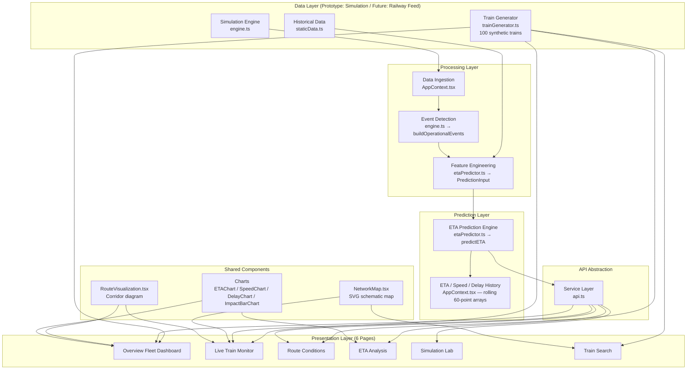

# SENRAIL — System Architecture

## Overview

SENRAIL follows a layered architecture where each layer has a single, well-defined responsibility. The key architectural principle is that the **simulation/data-ingestion layer is decoupled from the prediction engine**, so the prediction engine does not need to change when the data source changes.

A second key principle is that the **fleet dataset is decoupled from the simulation engine** — the train generator produces synthetic catalog data independently, while the simulation engine handles the live tick-by-tick updates for the actively monitored train.

---

## Architecture Diagram



---

## Layers

### 1. Data Layer

**Prototype:** `src/simulation/engine.ts`, `src/data/staticData.ts`, `src/data/trainGenerator.ts`

**Simulation Engine (`engine.ts`):**
- Maintains position, speed, and delay for the actively simulated train (12627 Karnataka Express)
- Applies scenario presets (Normal, Heavy Congestion, Track Maintenance, Heavy Rain, Signal Hold, Combined Disruption)
- Generates operational events (congestion, maintenance, weather, signal hold)
- Advances via a simulated railway clock starting at **13:05**, advancing **20 simulated seconds per 3-second tick**

**Train Generator (`trainGenerator.ts`):**
- Produces **100 synthetic trains** deterministically from a seeded RNG
- 25 route templates across all major Indian railway zones
- Each generated train has: number, name, type, route, stations, schedule, delay, speed, days of week
- Consistent output across every page load (same seed → same data)

**Static Data (`staticData.ts`):**
- 6 manually authored trains with full station-level schedules and historical baselines
- `ALL_TRAINS` export combines the 6 manual trains with 94 generated trains

**Future:** This entire layer is replaced by authorised railway data feeds (RTIS-style streaming telemetry + operational event streams). No other layer changes.

---

### 2. Processing Layer

**Files:** `src/store/AppContext.tsx`, `src/simulation/engine.ts`

Handles the tick-by-tick update cycle:
- Receives new train state from the simulation engine each tick
- Builds `PredictionInput` feature vector for the prediction engine
- Records rolling 60-point history arrays: `etaHistory`, `speedHistory`, `delayHistory`
- Guards against stale state with `?? []` fallbacks on all history arrays

**Simulated Clock:**
The app uses a simulated railway time (not wall-clock time). This ensures the ETA prediction target (destination arrival) is always close to the current simulated time, making chart movements visible and meaningful during demos.

---

### 3. Prediction Layer

**Files:** `src/prediction/etaPredictor.ts`

Accepts a `PredictionInput` struct and returns an `ETAPrediction` struct. The layer is stateless and pure — given the same inputs, it produces the same output.

**Key design decisions:**
- The formula is fully transparent and documented in `docs/ETA_PREDICTION.md`
- The feature set (`PredictionInput`) is designed to accommodate a future trained ML model
- Contributing factors are computed individually and returned as a list, enabling the explainability panel in the ETA Analysis page

---

### 4. API Abstraction Layer

**File:** `src/services/api.ts`

Exposes data through service functions matching the shape of future REST endpoints:

```
GET  /api/trains
GET  /api/trains/:id
GET  /api/trains/:id/eta
GET  /api/trains/search?q=&date=&timeFrom=&timeTo=
GET  /api/route-conditions
GET  /api/events
POST /api/simulation/scenario
```

Currently these are local functions backed by React state. In a backend deployment, these become actual HTTP endpoints without changing the UI layer.

---

### 5. Presentation Layer

**Files:** `src/pages/`, `src/components/`

Six pages, each with a focused responsibility:

| Page | File | Purpose |
|---|---|---|
| Overview | `OverviewPage.tsx` | Fleet stats, live-sim strip, speed/delay charts, 100-train table |
| Live Train Monitor | `LiveMonitorPage.tsx` | 100-train searchable fleet, per-train ETA + network map |
| Route Conditions | `RouteConditionsPage.tsx` | Section conditions for all 100 routes + live-sim sections |
| ETA Analysis | `ETAAnalysisPage.tsx` | ETA/Speed/Delay charts + impact bar chart |
| Simulation Lab | `SimLabPage.tsx` | Scenario controls + live condition display |
| Train Search | `TrainSearchPage.tsx` | Search by number/name/station/date/time + route detail |

**Shared components:**

| Component | Purpose |
|---|---|
| `NetworkMap.tsx` | SVG schematic showing all railway corridors, highlighted route, animated train position |
| `RouteVisualization.tsx` | Horizontal corridor timeline with station nodes |
| `ETAChart.tsx` | Area chart of ETA prediction history |
| `SpeedChart.tsx` | Area chart of speed history with speed-restriction reference |
| `DelayChart.tsx` | Area chart of delay history with on-time baseline |
| `ImpactBarChart.tsx` | Horizontal bar chart of ETA contributing factors |

---

## State Management

Global application state is managed via React Context + `useReducer`. The state shape is:

```typescript
interface AppState {
  simState: SimulationState;         // Simulation control and condition parameters
  trains: Train[];                   // Simulated trains with station ETAs
  sections: RouteSection[];          // Route sections with active events
  events: OperationalEvent[];        // All active operational events
  prediction: ETAPrediction | null;  // Current ETA prediction for selected train
  etaHistory: ETAHistoryPoint[];     // Rolling 60-point ETA history
  speedHistory: SpeedHistoryPoint[]; // Rolling 60-point speed history
  delayHistory: DelayHistoryPoint[]; // Rolling 60-point delay history
  lastUpdated: string;               // Timestamp of last tick
}
```

The `ALL_TRAINS` fleet catalog (100 trains) lives in `staticData.ts` and is consumed directly by the pages that need it — it is **not** part of the simulation state, keeping the reducer lean.

The simulation tick (`TICK` action) is the only action that triggers a full re-computation cycle.

---

## Data Flow

```
Simulation engine fires every 3 real seconds
        ↓
TICK action dispatched to AppContext
        ↓
Simulated clock advances +20 seconds
        ↓
updateTrains() → new Train[] (speed, delay, distanceRemaining)
        ↓
predictETA() → ETAPrediction (remaining time, ETA, factors, confidence)
        ↓
buildOperationalEvents() → OperationalEvent[]
        ↓
buildSections() → RouteSection[] with conditions
        ↓
etaHistory / speedHistory / delayHistory arrays updated (last 60 points)
        ↓
AppState updated → React re-renders all subscribed components
        ↓
Charts animate smoothly to new data points
```

---

## Network Map Architecture

The network map (`src/components/NetworkMap.tsx`) is built entirely in pure SVG — no external mapping library is required.

```
Station positions defined as (x, y) in a 560×710 viewBox
        ↓
CORRIDORS array defines line segments between station pairs
        ↓
On render: each segment is drawn; segments on the highlighted route
are drawn with blue stroke + glow overlay
        ↓
Current station gets an animated pulsing circle (SVG <animate>)
```

**Route definitions** (`TRAIN_ROUTES` record) map each train number to an ordered array of station codes. This is used by both `NetworkMap` and the corridor visualization.

---

## Key Design Principles

1. **Simulation ≠ Prediction** — The simulation engine and prediction engine are completely separate modules. Neither knows about the other's internals.

2. **Fleet ≠ Simulation** — The 100-train catalog is independent of the simulation engine. Pages that need fleet data import `ALL_TRAINS` directly; the reducer only manages the live-simulated train.

3. **Transparent Prediction** — Every factor contributing to the ETA is individually computed and returned. No black-box delay adjustments.

4. **Deterministic Data** — The train generator uses a seeded RNG so the same 100 trains appear on every page load, every time.

5. **Integration-first** — The API layer, data types, and prediction interface are designed for future railway data integration, not just for the prototype.

6. **No unnecessary complexity** — No backend, no database, no WebSocket infrastructure in the prototype. The architecture can accommodate all of these in production.

---

## Technology Decisions

| Decision | Rationale |
|---|---|
| React + TypeScript | Strong typing for domain objects; component model suits the dashboard layout |
| Vite | Fast builds; no configuration overhead |
| Recharts | Lightweight, composable charts with full TypeScript support |
| Pure SVG for network map | Zero dependencies; fully controllable styling and animation |
| Vanilla CSS | Full control over design system; no framework overhead |
| React Context + useReducer | Sufficient for this scale; avoids Redux complexity |
| Seeded deterministic RNG | Consistent demo data without a backend or database |
| No backend | Frontend-only prototype is self-contained and portable |

---

*SENRAIL · RUNTIME REBELS · SIH 2026 · PS SIH26028*
